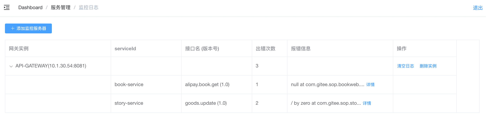

# 监控日志

1.10.0开始sop-admin提供了简单的监控日志查询，方便在线排查问题。

- 错误日志统一在网关负责收集
- 只收集未知类型的错误日志，开发人员主动throw的异常不收集
- sop-admin通过网关提供的restful接口获取日志内容，然后在后台展示
- 收集的日志存放在内存中，重启网关日志会消失
- 只会收集20条不同的日志内容，相同内容会count+1。可设置`ApiConfig.storeErrorCapacity`属性扩大容量，默认容量20

第一次使用需要添加网关服务器实例，前往：`服务管理--监控日志--添加监控服务器`

## 永久保存日志

默认收集的日志存放在内存中，重启网关日志会消失（见：`DefaultServiceErrorManager.java`）。如果要永久保存日志内容，需要自己实现`ServiceErrorManager`接口

```java
public class MyServiceErrorManager implements ServiceErrorManager {
    ...
}
```

然后在ApiConfig中配置

```java
@Configuration
public class ZuulConfig extends AlipayZuulConfiguration {

    static {
        ...
        ApiConfig.getInstance().setServiceErrorManager(new MyServiceErrorManager());
        // 日志收集容量，默认20。只会收集20条不同内容的日志
        ApiConfig.getInstance().setStoreErrorCapacity(20);
        ...
    }

}
```

- 后台预览



